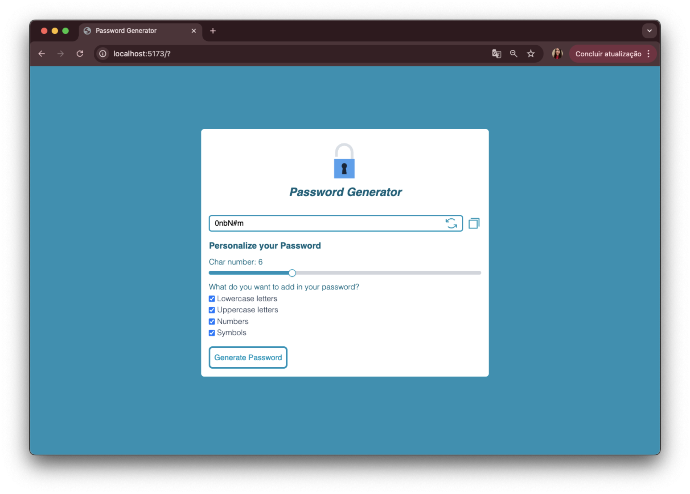

# 🔐 Password Generator App

A web application that generates random passwords customized based on user preferences. Built with **React**, styled with **Tailwind CSS**, interactions powered by **Radix UI**, and notifications using **React Toastify**.

 

---

## ✨ Features

* Set the password length using an interactive slider.
* Choose to include:

  * Lowercase letters
  * Uppercase letters
  * Numbers
  * Symbols
* Password generation guarantees at least one character from each selected type.
* Copy the password with one click.
* Notifications with `react-toastify` for user feedback.

---

## 🛠 Technologies Used

* [React](https://react.dev)
* [Tailwind CSS](https://tailwindcss.com/)
* [Radix UI - Slider](https://www.radix-ui.com/primitives/docs/components/slider)
* [React Toastify](https://fkhadra.github.io/react-toastify/)
* [Phosphor React Icons](https://phosphoricons.com/)

---

## 🚀 How to run the project

1. **Clone the repository:**

```bash
git clone https://github.com/your-username/password-generator.git
cd password-generator
```

